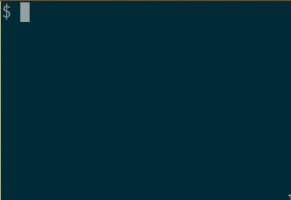

# Screenshots and OCR

## Dependencies
    - `xclip`
    - `imagemagick`
    - `tesseract-ocr`, `tesseract-ocr-jpn` and `tesseract-ocr-jpn_vert`
    - a notification (optional)

## Installation

Copy the files to a directory in you $PATH, e.g. `/usr/local/bin/'.

```$ cp /path/to/PICTURES/{printscreen,ocrshot} /usr/local/bin/```

Change permissions.

```# chmod 755 /usr/local/bin{printscreen,ocrshot}```

## Usage

### printscreen

### ocrshot


## Caveats
